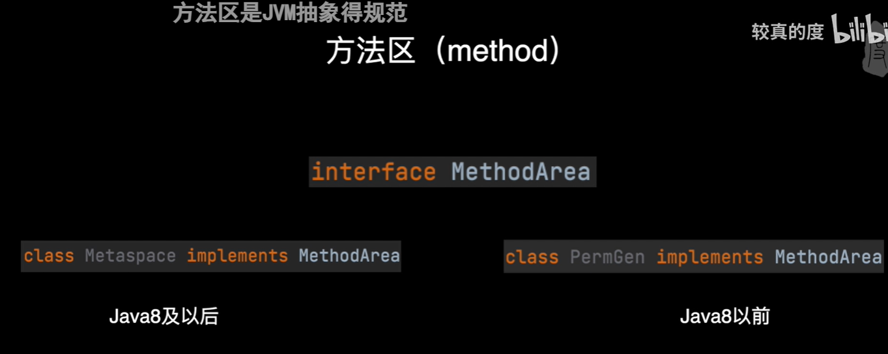

# 基础部分

## 1.java中四类八种基本数据类型?

整型: byte, short, int ,long --->1,2,4,8

浮点数: float,double-->4,8

字符类:char

布尔类:boolean

## 2.集合

HashSet集合通过hashCode()和equals()方法来保证存入集合的元素是唯一的.先比较hashCode值是否相等,若不相等,则存入,若相等,则调用equals()方法,不相等,则存入,相等,则不存.

ArrayList的初始容量10(初次添加元素时分配),扩容是旧容量*1.5,加载因子是1.


HashMap初始容量是16, 扩容是2倍, 加载因子是0.75(即12时扩容)当链表长度大于8, 数组长度大于等于64时,链表转化为红黑树, 减少深度,提高查询效率.

重写equals和hash方法是为了计算/比较的是属性值而不是内存地址.

## 3.常见的异常

1、java.lang.NullPointerException(空指针异常)

调用了未经初始化的对象或者是不存在的对象。经常出现在创建图片，调用数组这些操作中，比如图片未经初始化，或者图片创建时的路径错误等等。对数组操作中出现空指针， 即把数组的初始化和数组元素的初始化混淆起来了。数组的初始化是对数组分配需要的空间，而初始化后的数组，其中的元素并没有实例化， 依然是空的，所以还需要对每个元素都进行初始化(如果要调用的话)。

2、java.lang.ClassNotFoundException指定的类不存在

这里主要考虑一下类的名称和路径是否正确即可，通常都是程序试图通过字符串来加载某个类时可能引发异常。比如：调用Class.forName();或者调用ClassLoad的finaSystemClass();或者LoadClass();

3、java.lang.NumberFormatException字符串转换为数字异常

当试图将一个String转换为指定的数字类型，而该字符串确不满足数字类型要求的格式时，抛出该异常.如现在讲字符型的数据“123456”转换为数值型数据时，是允许的。但是如果字符型数据中包含了非数字型的字符，如123#56，此时转换为数值型时就会出现异常。系统就会捕捉到这个异常，并进行处理。

4、java.lang.IndexOutOfBoundsException数组下标越界异常

查看调用的数组或者字符串的下标值是不是超出了数组的范围，一般来说，显示(即直接用常数当下标)调用不太容易出这样的错，但隐式(即用变量表示下标)调用就经常出错了，还有一种情况，是程序中定义的数组的长度是通过某些特定方法决定的，不是事先声明的，这个时候先查看一下数组的length，以免出现这个异常。

5、java.lang.IllegalArgumentException方法的参数错误

比如g.setColor(int red,int green,int blue)这个方法中的三个值，如果有超过255的也会出现这个异常，因此一旦发现这个异常，我们要做的，就是赶紧去检查一下方法调用中的参数传递是不是出现了错误。

6、java.lang.IllegalAccessException没有访问权限

当应用程序要调用一个类，但当前的方法即没有对该类的访问权限便会出现这个异常。对程序中用了Package的情况下要注意这个异常。

7、java.lang.ArithmeticException数学运算异常

当算术运算中出现了除以零这样的运算就会出这样的异常。

8、java.lang.ClassCastException数据类型转换异常

当试图将对某个对象强制执行向下转型，但该对象又不可转换又不可转换为其子类的实例时将引发该异常，如下列代码。

Object obj = new Integer(0);

String str = obj;

9、java.lang.FileNotFoundException文件未找到异常

当程序试图打开一个不存在的文件进行读写时将会引发该异常。该异常由FileInputStream,FileOutputStream,RandomAccessFile的构造器声明抛出，即使被操作的文件存在，但是由于某些原因不可访问，比如打开一个只读文件进行写入，这些构造方法仍然会引发异常。

10、java.lang.ArrayStoreException数组存储异常

当试图将类型不兼容类型的对象存入一个Object[]数组时将引发异常，如

Object[] obj = new String[3]

obj[0] = new Integer(0);

11、java.lang.NoSuchMethodException方法不存在异常

当程序试图通过反射来创建对象，访问(修改或读取)某个方法，但是该方法不存在就会引发异常。

12、java.lang.NoSuchFiledException方法不存在异常

当程序试图通过反射来创建对象，访问(修改或读取)某个filed，但是该filed不存在就会引发异常。

13、java.lang.EOFException文件已结束异常

当程序在输入的过程中遇到文件或流的结尾时，引发异常。因此该异常用于检查是否达到文件或流的结尾

14、java.lang.InstantiationException实例化异常

当试图通过Class的newInstance()方法创建某个类的实例,但程序无法通过该构造器来创建该对象时引发。Class对象表示一个抽象类，接口，数组类，基本类型 。该Class表示的类没有对应的构造器。

15、java.lang.InterruptedException被中止异常

当某个线程处于长时间的等待、休眠或其他暂停状态，而此时其他的线程通过Thread的interrupt方法终止该线程时抛出该异常。

16、java.lang.CloneNotSupportedException 不支持克隆异常

当没有实现Cloneable接口或者不支持克隆方法时,调用其clone()方法则抛出该异常。

17、java.lang.OutOfMemoryException 内存不足错误

当可用内存不足以让Java虚拟机分配给一个对象时抛出该错误。

18、java.lang.NoClassDefFoundException 未找到类定义错误

当Java虚拟机或者类装载器试图实例化某个类，而找不到该类的定义时抛出该错误。

违背安全原则异常：SecturityException

操作数据库异常：SQLException

输入输出异常：IOException

通信异常：SocketException

## jvm的内存模型



方法区是jvm抽象的规范,而元空间和永久代则是对该抽象的具体实现.

当时永久代是堆空间的一部分,1.8及其之后独立出来成为元空间, 它没有使用到堆内存而是使用了和堆不相连的本地内存区域,理论上系统内存有多大,元空间内存就有多大.

简单理解为使用其他语言编写的交由java运行的方法,使用native关键字描述的就是本地方法,给这些本地方法单独开辟成栈--->**本地方法栈;**


堆(存放对象), 方法区(存放一些运行时常量和类元数据信息), 栈(存放基本数据类型和对堆中对象的引用), 本地方法栈, 程序计数器(记录当前线程运行到了哪一个位置).

## 4.二分查找,冒泡查询,选择查找

```java
public class demo1 {

    @Test
    public void demoTest() {
//二分查找 前提是一个有序的数组
//定义左边界右边界,循环执行二分查找
        int[] array = {1, 5, 8, 11, 19, 22, 31, 35, 40, 45, 48, 49, 50};
        int target = 48;
        int idx = binarySearch(array, target);
        System.out.println(idx);
    }

    //二分查找,找到返回元素索引,找不到返回-1
    //增强:解决整数索引溢出的问题
    public static int binarySearch(int[] a, int t) {
        int l = 0, r = a.length - 1, m;
        while (l <= r) {
            m = (l + r) >>>1;
            if (a[m] == t) {
                return m;
            } else if (a[m] > t) {
                r = m - 1;
            } else {
                l = m + 1;
            }
        }
        return -1;
    }

//m = (l + r) / 2  变换成   m=l/2+r/2 变换为  m= l+(r-l)/2
    
//方法2   就是使用移位运算,CPU消耗大幅度减少 m=(l+r)>>>1; 相当于除以2 也不会发生整数溢出
    
奇数二分取中间
偶数二分取中间靠左
}
```

## 5.类的加载

类的加载过程分为三个阶段

1.加载: 

将类的字节码载入到方法区(类的字节码是载入到方法区的),并创建类.class对象(类对象是存在堆中的);

如果此类的父类没有加载,先加载父类;

加载时懒惰执行;

2.链接:

验证(验证类是否复合Class规范, 合法性, 安全性检查), 准备(为static变量分配空间,设置默认值), 解析(将常量池的符号引用解析为直接引用)

3.初始化

执行静态代码块与非final静态变量的赋值

初始化也是懒惰执行

```java
//使用JDK自带的调试工具HSDB,输入进程号,查看内存状态
--->验证得 类的加载是懒惰的
--->类对象存在堆内存的   
```


# 李帅总结

外包推荐：具体哪个公司没说，地址：南山华润大厦   做证券的

1.你负责的模块有那些表?

APP用户表,HOMEUP表(由APP用户表实名认证而来)

Resource表(HomeUp发布的房源信息),通过RabbitMQ异步审核后(自助审核人工审核),使用了XXL-JOB定时检查Resource的status和publish_time到时就同步3张表

分别是HomeNews,HomeNewsConfig,HomeContent同步完之后Feign更改Resource表的status为已经发布;


ApUserEntity表--------------------->每一个用户连上来都有一个实体行为表,匿名的是设备id,登陆的是用户id,以实体表为中心,根据entity_Id查到ApUserEntity表的Id才能根据ApUserEntity的Id跟其他条件查询行为表------>ApUser行为表(包含 评论[2张评论及其回复],关注,点赞表);


联想词表,搜索热词表;

一共13张表;


2.表怎么关联

同上;

3.数据分析模块和你的模快怎么分析


4.在controller使用的注解

@RequestBody

@RestController

@RequestMapping

@RequestParam

@PathVariable


5.@RequestMapping里面的consumes和produces的区别

在Request中
ContentType 用来告诉服务器当前发送的数据是什么格式
Accept 用来告诉服务器，客户端能认识哪些格式,最好返回这些格式中的其中一种


consumes 用来限制ContentType
produces 用来限制Accept


6.你们用的mysql的版本是

4.0


7.mysql用到了json类型的字段吗


8.mysql怎么设置锁超时时间


9.你遇见死锁问题吗

碰到过,


10.mysql怎么加共享锁的命令，排他锁，


11.lock in share mode跟for update有什么区别


12.minio，那一块会用到这个

上传一些证件照,合同文件的时候;


13.mysql的创建索引命令

ALTER TABLE `table_name` ADD INDEX  ( `column` ) *--注：这是创建普通索引，默认名字与列名一样*


14.创建表的命令

CREATE TABLE


15.mysql有几种日志

**MySQL中有六种日志文件**

重做日志（redo log）、

[回滚](https://so.csdn.net/so/search?q=回滚&spm=1001.2101.3001.7020)日志（undo log）、

[二进制](https://so.csdn.net/so/search?q=二进制&spm=1001.2101.3001.7020)日志（binlog）、

错误日志（errorlog）、

慢查询日志（slow query log）、

一般查询日志（general log）

中继日志（relay log）


16.redo log和undo log区别


17.怎么扫描到mapper

直接在接口上打上@Mapper的注解或者在启动类上打上@MapperScan的注解


18.怎么扫描xml文件

在yaml文件里配置Mybatis-plus的Mapper-location的属性指定xml文件所在的位置;


19.mapper分文件怎么扫描到多个


20.mybatispuls的mapper层要继承那个类

继承BaseMapper类,其中泛型为要操作的实体类.


21.service层要继承那个类

Service要继承Iservice类,泛型为要操作的实体类.

实现类要继承ServiceImpl类,泛型是对应Mapper和实体类;


22.怎么配置创建时间和修改时间自动设置


23.如果你配置了自动设置，别的组件也配置了处理自动设置，会有什么问题


24.mybatisplus的分页查询xml需要加limit的字段


25.你怎么开启事务

在接口或者实现类的方法上打上@Transational的注解;


26.事务注解怎么针对某种异常进行回滚

实际上事务就是基于AOP的原理进行实现的,当异常发生的时候AOP起效,catch了这个异常执行里面的业务,使用undolog日志对其进行回滚处理;


27.有多个事务管理管理器，这个注解会出问题吗   


28.具体指定那个使用那个事务怎么处理


29.如果不指定某个事务，加个@普买摸瑞有什么效果


30.注入时有多个实现类，怎么注入

如果类型有重复,我们是优先使用JDK提供的注解@Resource或者使用@Autowired搭配@Qualifier一起使用,以Bean的Id名称做为注入的条件;


31.如果不指定名字，在其中的一个实现类加@primary 有什么用

如果用@primary,Spring会优先注入该实现类;


32.在注入时发现bean没有初始化成功，但我还想使用，我该怎么做

可以使用Try{}catch{}的方法去处理这个异常,返回一个new出来的对象;

# 模拟面试

### 1.MySQL保持数据一致的问题?

for update->排他锁

lock in share mode->共享锁

CAS机制;

乐观锁;

### 2.为什么重写equals方法和hash方法,hashmap的key是否可以为null(可以,只能有一个).

使其比较(计算)的是属性值,而不是(计算)内存地址的值.

### 3MySQL乐观锁和悲观锁?

### 4.消息重复消费的问题?

加token,存入redis

### 5.swagger-->接口管理   和禅道--->的具体作用?  禅道是对项目管理的,swagger是对接口进行管理的;

### 6.mysql左连接,右连接?

```java
① 先执行on，后执行where；on是建立关联关系在生成临时表时候执行，where是在临时表生成后对数据进行筛选的。
②比如两个表进行left join连接查询结果，where会对查询的结果进行过滤， on会返回驱动表的所有数据。
③left join按照条件关联，不管是否为真，都返回左边表的数据。

左连接：以左表为主
select a.*,b.* from a left join b on a.b_id b.id;
右连接：以右表为主
select a.*,b.* from a right join b on a.b_id b.id;

内连接：只列出两张表关联查询符合条件的记录
setect a.*,b.* from a inner join b on a.b_id b.id;
```

**WHERE 和 HAVING 关键字存在以下几点差异：**

- 一般情况下，WHERE 用于**过滤数据行**，而 HAVING 用于**过滤分组**。
- WHERE 查询条件中不可以使用**聚合函数**，而 HAVING 查询条件中可以使用[聚合函数](https://so.csdn.net/so/search?q=聚合函数&spm=1001.2101.3001.7020)。
- WHERE 在数据**分组前**进行过滤，而 HAVING 在数据**分组后**进行过滤 。
- WHERE 针对数据库文件进行过滤，而 HAVING 针对查询结果进行过滤。也就是说，WHERE 根据**数据表中的字段**直接进行过滤，而 HAVING 是根据前面已经**查询出的字段**进行过滤。
- WHERE 查询条件中不可以使用**字段别名**，而 HAVING 查询条件中可以使用字段别名。

### 7.union有了解吗?

union操作用于合并两个或者多个select语句的结果集

使用注意事项：

1. UNION内部的SELECT语句必须拥有相同数量的列，列也必须拥有相似的数据类型。
2. 每条SELECT语句中列的顺序必须相同。

```java
SELECT ID,name FROM emp1
UNION
SELECT ID,name FROM emp2
```

union all的使用: 合并且去掉重复的值

### 8.索引的优缺点,创建索引的命令?

### 9.tar命令?

```shell
[root@Centos8 shell_scripy]# tar -cvf etc.tar  /etc/						#仅仅是打包，并没有压缩
[root@Centos8 shell_scripy]# tar -xvf etc.tar								#解包

[root@Centos8 shell_scripy]#  tar -czvf etc.tar.gz /etc/					#打包并压缩/etc/目录，压缩包存放在当前目录，名字为etc.tar.gz
[root@Centos8 shell_scripy]#  tar -xzvf  etc.tar.gz -C ./find/				#解压缩etc.tar.gz到指定目录，如果是解压到当前目录，可以不用加-C
[root@Centos8 shell_scripy]# tar -tvf  etc.tar.gz 							#查看压缩包内容
```


打包，亦为归档，其意为：将一个或多个文件或目录变成一个总的目录文件。文件不会变小，有可能变大，有可能增加一些附加标注信息。这个过程，你可以近似的理解为windows中的多个文件或目录移动到一个指定的目录下面。

压缩：是将一个或多个文件，结合压缩程序，通过压缩程序特定的算法，将其“封装”成为一个特殊格式的新文件的过程。这个压缩的过程，与windows 系统里面的压缩的概念是一样的。

### 10.MVVC的理解?

Multi-Version Concurrency Control多版本并发控制.

主要是为了提高数据库的并发性能(不用加锁),讲的MVCC是基于快照读的.

使用undolog, 版本链, readview

### 11.Map根据value的值进行排序(简单易懂)

1、将Map的entrySet转换为List
2、用Collections工具类的sort方法排序
3、遍历·排序好的list，将每组key，value放进LinkedHashMap(Map的实现类只有LinkedHashMap是根据插入顺序来存储)

## 华为外包面试题:

###### 1.自我介绍,项目介绍

###### 2.Spring 和Spring Boot 有什么区别和联系,SpringBoot有什么优势?  

Spring是一个开源容器框架，可以接管web层，业务层，dao层，持久层的组件.

并且可以配置各种bean,和维护bean与bean之间的关系, 其核心就是控制反转(OC)和面向切面(AOP),简单的说就是一个分层的轻量级开源框架.


SpringMVC属于SpringFrameWork的后续产品，已经融合在Spring Web Flow里面, 它是一种MVC框架,用于代替Servlet处理,响应请求,获取表单参数,表单校验;


SpringBoot是为了简化Spring应用的创建,运行,调试,部署等出现的, 使用它可以做到专注于Spring应用的开发而无须过多关注XML, 它提供了一堆依赖打包，并已经按照使用习惯解决了依赖问题;

###### 3.JWT鉴权和微服务远程调用鉴权怎么实现的?

###### 4.MyBatis 和 MyBatis Plus区别?

###### 5.SQL优化问题 SQL注入问题?

通过expain查询是否执行索引,最常出现的type的值是ref.

###### 6.数据库建库建表有做过吗?有哪些注意事项?

表名,字段名使用小写字母或者数字,不能以数字开头,不能两个下滑线中间只出现数字.

表名不使用复数名词.

小数类型使用decimal,不使用float和double.

###### 7.数据库宕机了怎么处理?

###### 8.项目中技术选型是怎么选的?

###### 9.分布式事务怎么处理的?

###### 10.项目中用了设计模式吗?用了哪些设计模式,具体怎么实现的?

###### 11.用过Oracle吗?

###### 12.说说非关系型数据库MogonDB和Redis?

###### 13.有部署过环境吗?具体怎么部署的

###### 14.使用过线程池吗?怎么使用的

# 面试题一

1.try with resource的用法？

```java
JDK7提供新特性：
try-resource --->实际上就是try多了个圆括号
使用场景: IO流让其自动自己关闭 

try(创建需要关闭对象的代码放在这儿){
catch (Exception e){
}
```

2.zookeeper的主要节点类型以及用途？

3.web程序会出现哪些安全问题，有什么措施？
4.redis用于消息队列的优缺点?
5.optional类型的使用场景？
6.message queue 消息队列？

# 模拟面试二

###### 1.MySQL完成批量导入

**如果使用easyexcel进行批量插入,每次操作完没有完成插入,而是先存到缓存里,等累积好了上万条,再一次性插入;**


**如果是使用Mybatis是怎么进行批量插入呢?**

假如我要插入100万条记录,直接开100个线程,一个线程处理一万个记录,5000条记录为一批;

**--->我们测了好几次大概用了100万条数据去测,发现一次5000条用的时间是最短的(大概一次5000花2s)---->多线程+批量导入;**

1.一种是for循环一次插入一条;

2.一种for循环先把数据放在List集合中,再一次性插入使用insert into 表名 value()()()....SQL语句拼接,这种数据量一多解析起来难度大,效率低,本质还是一条条插入,伪批量插入;

3.最后一种是使用Mybatis的batch模式(先开启事务(开启这个模式), 再foreach(**foreach的性能比for高出20%**)执行方法提交最后循环完毕再提交事务);

其关键在于**循环完毕再提交事务**!!

```java
import org.apache.ibatis.io.Resources;
import org.apache.ibatis.session.ExecutorType;
import org.apache.ibatis.session.SqlSession;
import org.apache.ibatis.session.SqlSessionFactory;
import org.apache.ibatis.session.SqlSessionFactoryBuilder;

@Test
    public void testBatchInsert(){
        SqlSession sqlSession = sqlSessionFactory.openSession(ExecutorType.BATCH);
        StudentDao studentDao = sqlSession.getMapper(StudentDao.class);
        List<Student> list = new ArrayList<>();
        for (int i = 0; i < 100; i++) {
            Student student = new Student();
            student.setSname("小红" + i);
            list.add(student);
        }

        list.forEach(s->studentDao.add(s));
        // 把内存的操作推送给数据库, 释放内存
        sqlSession.flushStatements();
        // 事务提交
        sqlSession.commit();
    }
```

###### 2.还有使用登录功能遇到的最大问题是什么？

可以说到SQL语句的优化,操作5张表超过2000ms超时! ----->尽量使用子查询,不使用连接查询;

###### 3.JWT被盗取

**注意没有被篡改过只是本来应该发给A的被B拿了,怎么防止B访问成功?**

**使用非对称算法,生成公匙和私匙.**

###### 4.怎么回答平时怎么去看外网资料?

Github扒源码,

###### 5.线程池的使用场景,如何使用?

**1.继承Thread类,重写run方法--->继承不了其他类,不利于扩展**

```java
class MyThread extends Thread{
    @Override
    public void run() {
        System.out.println("hello,Thread");
    }
}
public class ThreadDemo1 {
    public static void main(String[] args) {
    Thread t =new MyThread();
    t.start();
    t.run();
    }

```

**2.实现Runnable接口,重写run方法--->调用线程的start方法启动线程**

```java
class MyRunnable implements Runnable{
    @Override
    public void run() {
while (true){
    System.out.println("hello,Thread");
    try {
        Thread.sleep(1000);
    } catch (InterruptedException e) {
        e.printStackTrace();
    }
}
    }
}
public class ThreadDemo3 {
    public static void main(String[] args) {
        Thread t =new Thread(new MyRunnable());
        t.start();
    }}
```

**3.实现Callable, Future Task接口**

1.之前的重写的run方法均不能直接返回结果;

2.不适合需要返回线程执行结果的业务场景;

```java
public class ThreadDemo4 {
/**
 * 目标:学会线程的创建方式三: 实现Callable接口，结合FutureTask完成
 *
 * */
public static void main(String[] args) {

    //3.创建Callable任务对象
    Callable<String> call=new MyCallable(100);
    //4.把Callable任务对象，交给FutureTask对象
    //FutureTask对象的作用1:是Runnable的对象(实现了Runnable接口),可以交给Thread了
    //FutureTask对象的作用2:可以在线程执行完毕之后通过调用其get方法得到线程执行完成的结果
    FutureTask<String> f1=new FutureTask<>(call);
    //5.交给线程处理
    Thread t1=new Thread(f1);
    //启动线程
    t1.start();


    //获取结果
    try {
        //如果f1任务没有执行完毕，这里的代码会等待，直到线程1跑完才提取结果
        String rs1=f1.get();
        System.out.println("第一个结果:"+rs1);
    }catch (Exception e) {
        e.printStackTrace();
    }

}
}

class MyCallable implements Callable<String>{
/**
 * 1.定义一个任务类，实现Callable接口  应该声明线程任务执行完毕后的结果的数据类型
 * */
private int n;
public MyCallable(int n){
    this.n=n;
}
/**
* 重写call方法
* */
@Override
public String call() throws Exception {

    int sum=0;
    for(int i=1;i<=n;i++){
        sum+=i;
    }
    return "子线程执行的结果是:"+sum;
}
}
```


- 定义类实现Callable接口,重写call方法,封装要做的事情;
- 用FutureTask把Callable对象封装成线程任务对象;
- 把线程任务对象交给Thread对象;
- 调用Thread的start方法启动线程,执行任务;
- 线程执行完毕之后,通过FutureTask的get方法去获取任务执行的结果;

4.ThreadPoolExecutor, 直接new一个线程池, 设置参数(核心线程数, 最大线程数, 线程空闲时间, 允许核心线程超时, 任务拒绝器 ...)

5.Executor.newFixedThreadPool(4).

###### 6.异步线程怎么开启?

###### 7.设计模式使用过哪些?

模板模式;

代理模式;

单例模式;

策略模式;-->省略if-else

# 面试题二(港企)

1.beanfactory和factorybean的区别？

前者是IOC容器,后者是个Bean对象,beanfactory可以对bean对象进行管理,factorybean是一个能够生产或者修饰对象生成的工厂bean.它的实现跟工厂模式和修饰器模式类似.

2.beanfactory和applicationcontext的区别？

都是Spring的顶级接口,定义了IOC的基本功能,applicationcontext是beanfactory的子接口,功能更多,提供在监听器中注册bean的事件.

除此之外,beanfactory使用延迟加载, 使用时才去加载bean对象,applicationcontext容器启动的时候就会去一次性创建所有bean.

###### 3.redis的淘汰策略？redis的使用场景？

第一个方面：

当 Redis 使用的内存达到 maxmemory 参数配置的阈值的时候，Redis 就会根据

配置的内存淘汰策略。

把访问频率不高的 key 从内存中移除。

maxmemory 默认情况是当前服务器的最大内存。

第二个方面：

Redis 默认提供了 8 种缓存淘汰策略，这 8 种缓存淘汰策略总的来说，我认为可

以归类成五种

第一种， 采用 LRU 策略，就是把不经常使用的 key 淘汰掉。

第二种，采用 LFU 策略，它在 LRU 算法上做了优化，增加了数据访问次数，从

而确保淘汰的是非热点 key。

第三种，随机策略，也就是是随机删除一些 key。

第四种，ttl 策略，从设置了过期时间的 key 里面，挑选出过期时间最近的 key

进行优先淘汰

第五种，当内存不够的时候，直接报错，这是默认的策略。

这些策略可以在 redis.conf 文件中手动配置和修改，我们可以根据缓存的类型和

缓存使用的场景来选择合适的淘汰策略。

最后一个方面，我们在使用缓存的时候，建议是增加这些缓存的过期时间。

因为我们知道这些缓存大概的生命周期，从而更好的利用内存。

以上就是我对这个问题的理解

###### 4.HashMap是线程安全吗？HashMap为什么使用链表结构，HashMap什么时候使用红黑树？它的初始长度和扩容机制？

数组+链表+红黑树==>初始16,加载因子0.75即是长度12时触发扩容,扩容2倍.

数组长度大于64,链表长度为8时触发链表转成红黑树, 使用链表原因是hash冲突时放在同一个链表上.

5.volatile关键字的作用？什么是指令重排？
6.synchronized锁升级？
7.脏读是什么？幻读是什么？怎么解决？
8.消息重复消费的问题？
9.设想场景，京东支付下单未付款，30分钟自动取消，你会怎么去实现？
10.设置a,b,c三个字段为组合索引。查询a,c字段走不走索引？
11.mvcc是什么？
12.什么是AQS?

13.自定义线程池,参数,拒绝策略?


# 牛信 一面 面试题记录

1.自我介绍
2.你们公司的技术栈是什么？
3.配置中心用的什么？
4.网关是用的什么？
5.监控体系是什么？
6.你们是怎么发现自己的问题的？
7.服务事务性？数据一致性？
8.高并发怎么解决？
9.日常性能优化怎么做的？
10.系统开发的一个流程，系统的质量保证？
11.解决hash冲突策略？
12.为什么要用多线程，不用多进程？
13.你有什么要问我的？