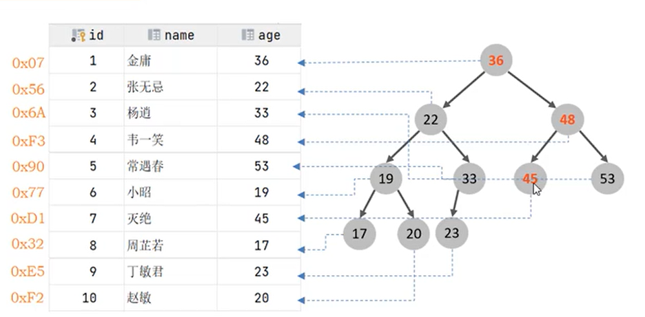
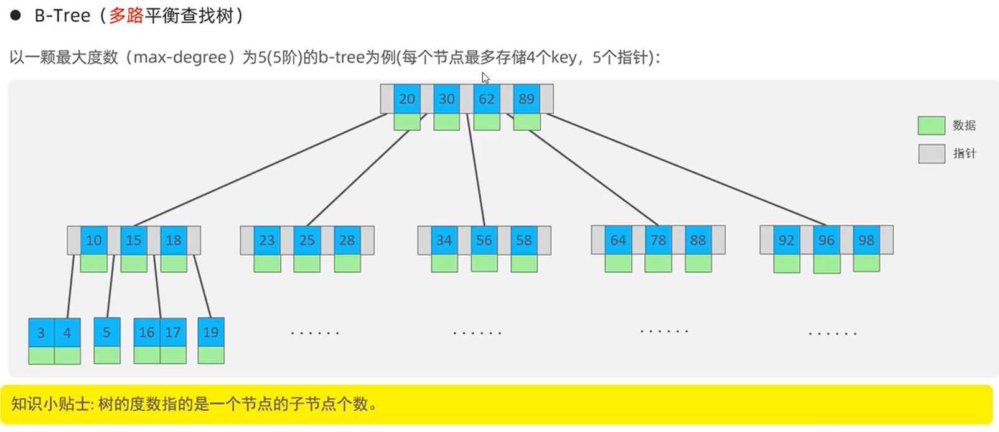
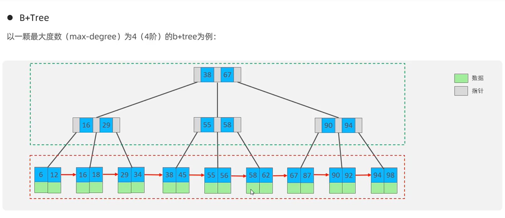
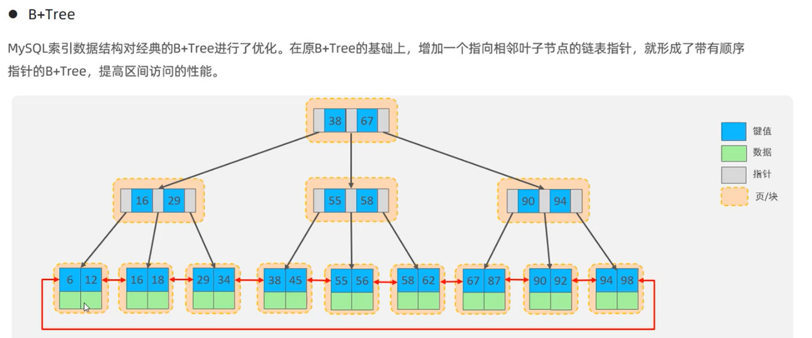
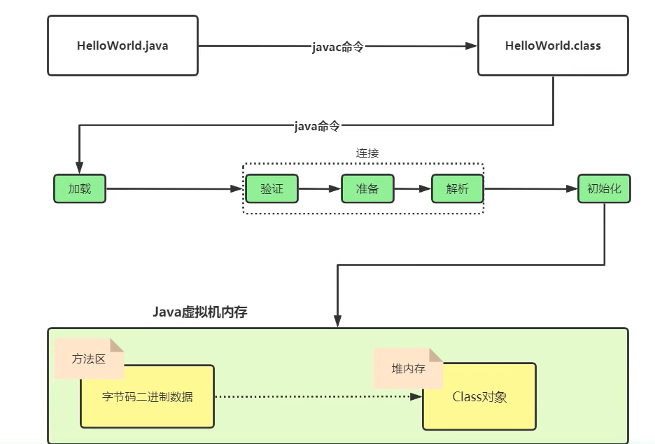
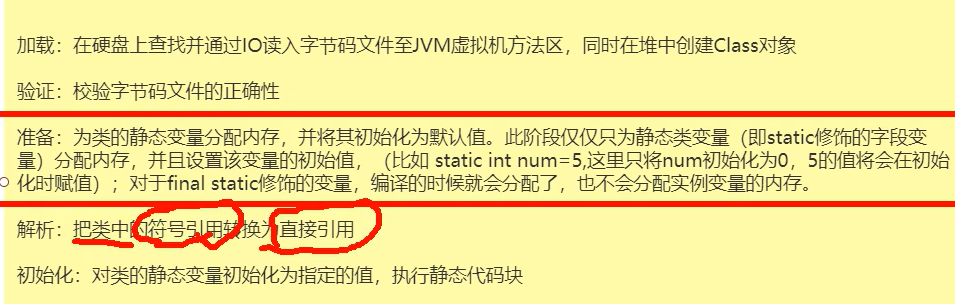
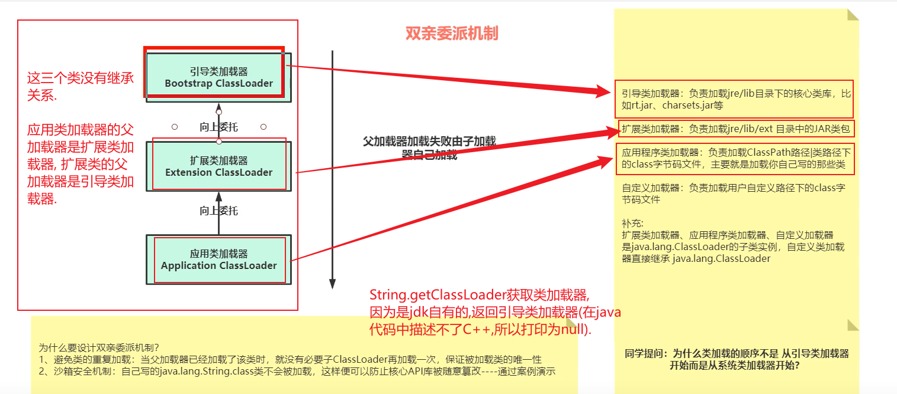
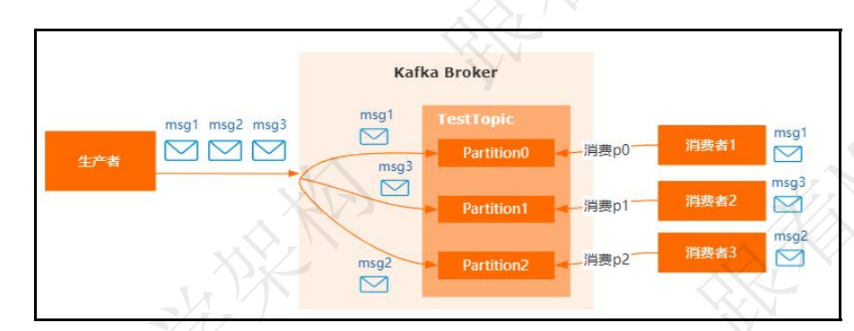
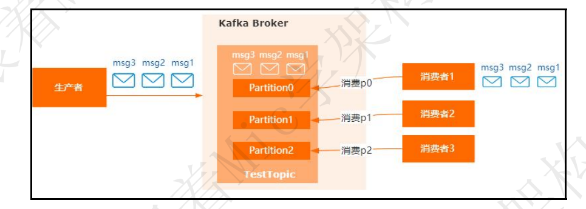

# 1.SpringBoot高级

## 一.SpringBoot如何完成自动装配的?(分析阶段,可跳过)

### 1.Condition判断什么决定 要不要创建RedisTemplate对象?

**答:判断依赖是否存在,判断spring是否存在redisTemplate对象------>RedisAutoConfiguration自动装配类**

在这个自动装配类中有两个注解:ConditionalOnClass(RedisOperations.class)  和 @ConditionalOnMissingBean(name = "redisTemplate");

前者判断是否有redis相关的依赖,后者判断spring容器中是否有redis的bean对象;

#### -->(1).我们自定义一个类继承Condition接口,重写里面的match方法,在match方法中判断有无某个依赖;

```java
public class MyCondition implements Condition {
    /**
     * 返回true 则满足条件  返回false 则不满足条件
     *
     * @param context  上下文信息对象 可以获取环境的信息 和容器工程 和类加载器对象
     * @param metadata 注解的元数据 获取注解的属性信息
     * @return
     */
    @Override
    public boolean matches(ConditionContext context, AnnotatedTypeMetadata metadata) {

        //1.获取当前的redis的类字节码对象
        try {
            //2.加载成功则说明存在 redis的依赖 返回true，
            Class.forName("redis.clients.jedis.Jedis");
            return true;
        } catch (ClassNotFoundException e) {
            // 如果加载不成功则redis依赖不存在 返回false
            e.printStackTrace();
            return false;
        }
    }
}
```

然后打一个注解(@Conditional)在创造bean对象的方法上, value值为自定义类,这样就实现了自定义类bean对象的自动装配;

```java
package com.itheima.config;

import com.itheima.condition.MyCondition;
import com.itheima.pojo.User;
import org.springframework.context.annotation.Bean;
import org.springframework.context.annotation.Conditional;
import org.springframework.context.annotation.Configuration;

@Configuration
public class UserConfig {

    @Bean
    //conditinal 用于指定当某一个条件满足并返回true时则执行该方法创建bean交给spring容器
    @Conditional(value = MyCondition.class)
    public User user() {
        return new User();
    }
}
```

#### -->(2)但是上面有一个问题,在match方法中判断是已经写死了类的全路径了,现在需要动态的判断;

为了实现这个,我们使用自定义注解来替代上面的代码块中@Conditional注解;

使用**@MyConditional(name="redis.clients.jedis.Jedis")**替代**@Conditional(value = MyCondition.class)**;

```java
package com.itheima.annotation;

import com.itheima.condition.OnClassCondition;
import org.springframework.context.annotation.Conditional;

import java.lang.annotation.*;

@Target({ ElementType.TYPE, ElementType.METHOD })
@Retention(RetentionPolicy.RUNTIME)
@Documented
@Conditional(MyCondition.class)
public @interface MyConditionalOnClass {
    /**
     * 指定所有的类全路径的字符数组
     * @return
     */
    String[] name() default {};
}
```

修改配置类

```java
@Configuration
public class UserConfig {

    @Bean
    //conditinal 用于指定当某一个条件满足并返回true时则执行该方法创建bean交给spring容器
    @MyConditionalOnClass(name = "redis.clients.jedis.Jedis")
    public User user() {
        return new User();
    }
}
```

修改实现类

```java
public class MyCondition implements Condition {
    /**
     * 返回true 则满足条件  返回false 则不满足条件
     *
     * @param context  上下文信息对象 可以获取环境的信息 和容器工程 和类加载器对象
     * @param metadata 注解的元数据 获取注解的属性信息
     * @return
     */
    @Override
    public boolean matches(ConditionContext context, AnnotatedTypeMetadata metadata) {

        //1.获取当前的redis的类字节码对象
        /*try {
            //2.加载成功则说明存在 redis的依赖 返回true，
            Class.forName("redis.clients.jedis.Jedis");
            return true;
        } catch (ClassNotFoundException e) {
            // 如果加载不成功则redis依赖不存在 返回false
            e.printStackTrace();
            return false;
        }*/
        //获取注解的信息
        Map<String, Object> annotationAttributes = metadata.getAnnotationAttributes(MyConditionalOnClass.class.getName());
        //获取注解中的name的方法的数据值
        String[] values = (String[]) annotationAttributes.get("name");
        for (String value : values) {
            try { 
                Class.forName(value);
            } catch (ClassNotFoundException e) {
                e.printStackTrace();
                return false;
            }
        }
        return true;
    }
}
```

补充:如果打了@Bean和@Service或者@Controller的注解的类不在启动类的包或者子包下那么有两种方法可以解决;

#### 其一:在启动类上打上@ComponentScan的注解设置注解的值可以指定某一个包

#### 其二:在启动类上打上@Import(注意这是Spring本身的注解)Spring配置文件中<Import>标签将**一个配置文件导入到另一个配置文件中**;

可以看到在@springbootapplication的注解中就有一个@EnableAutoConfiguration,而在这个注解中就有一个import的注解属性是**AutoConfigurationImportSelector.class**这就是个选择器,2.0.1版本跟其他版本不一样,2.1.0版本执行的是**getAutoConfigurationEntry**方法,(这些类的全路径全部都在META-INF中,前两个都是必须要加的,第一个直接照抄,第二个就是自己写的自动配置类)将118个类全路径全部加载进类中(像redis等全路径都被加载进来);

执行完这个选择类之后,比如就到了RedisAutoConfiguration的类中的了(这里就跟前面连起来了)-----用到了反射技术,拦截器技术,动态代理--->因为在RedisAutoConfiguration类上有条件判断一旦发现有依赖加入就会判断是否是对应的依赖,是否springMVC中有该bean对象,有的话就不会创建,没有就会创建;

**真正去注册的时候每一个起步依赖都是会实现importBeanDefinitionRegister这个接口的(外层是ImportSelector,再外层就是Import的注解)**

这里还有一个问题--->只是创建了bean对象没有对bean对象进行配置?实际上不是的,在redis自动配置类上有一个注解@EnableConfigurationProperties,这个注解可以加载将application.yaml中的环境参数加载进bean对象中;

## 二.底层如何完成自动装配的?(八股文)

**1.springboot工程启动加载启动类上注解@SpringBootApplication**
**2.加载到@EnableAutoConfiguration开启自动装配功能**
**3.加载到@Import(AutoConfigurationImportSelector.class)**
**4.AutoConfigurationImportSelector自动配置选择类，selectImports(2.0.1) getAutoConfigurationEntry(2.1.0)方法**
  **加载所有依赖中(注意是所有依赖中的)META-INF/spring.factories（如果自定义类自动配置类跟这里一样即可）**
**5.执行加载spring.factories文件后得到118个自动装配类的全路径**
**6.通过反射、拦截器、动态代理最终得到xxxxAutoConfiguration自动配置类对象**
**7.加载到xxxxxAutoConfiguration自动配置类对象后，通过@Conditionalxxxx注解进行条件判断**
 **（例如：redis @ConditionalOnClass：判断依赖存在才往下执行 @ConditionalOnMissingBean：spring容器不存在redisTemplate才创建对象）**
**8.如果条件符合，创建xxx对象的同时，加载对象所需的配置文件，通过@EnableConfigurationProperties注解得到xxxProperties(跟配置文件对应对象)**
**9.最终将对象创建放入spring容器中**


###### 问题一:Springboot的核心注解有哪些以及作用?

一个是启动类上面的springbootapplication, 标识当前类是一个启动类

第二个呢就是加载了这个启动类注解之后,它的内部有一个springbootconfiguration,它也是spring的,它其实就相当于一个打了@configuration的类,跟applicationContext.xml的作用是一样的;

第三个呢也是非常重要的一个注解,叫@EnableAutoConfiguration,是开启自动装配的一个注解;


###### 问题二: condition判断什么决定要不要创建redisTemplate对象?

它是spring4之后提供的一个专门做条件判断的接口, 针对这个接口有很多注解提供给我们去使用;


###### 问题三:springboot工程在启动的时候怎么完成自动装配组的?

这个原理我是有做过源码调试的做过分析的,当前的话我是针对的是springboot2.1.0的这个版本来分析的,我项目里面用的就是2.1.0;

首先项目启动之后,项目启动类上有个注解叫springbootapplication,加载了这个注解,springbootapplication里面呢就有一个叫@EnableAutoConfiguration的注解,就是这个注解开启了自动装配的功能,在这一个注解里面又会有一个叫import的注解,这个注解被赋予了一个叫AutoConfigurationImportSelector.class的值,实际上这个值就是自动配置选择类,在这个类里面, 我事先了解过因为版本的差异执行的方法不太一样,低版本的springboot的像2.0.1执行的方法是selectImports, 那我主要研究的是2.1.0,它执行的方法是getAutoConfigurationEntry,通过这个方法它会加载所有依赖下META-INF目录下的spring.factories文件,拿到118个类的全路径;之后呢主要就是通过反射技术得到以AutoConfiguration结尾的自动配置类对象;

在自动配置类对象里面又会用到spring4开始之后提供的condition接口, 这个接口提供了很多注解,都是以condition开头的,根据不同的技术会进行相应的条件判断,比如说我们项目中经常用到的redis的起步依赖,它这里就用到了两个注解,一个叫@ConditionalOnClass打在类上,判断依赖是否存在一个叫@ConditionalOnMissingBean,判断spring容器中是否存在该bean对象,如果符合依赖存在,容器中不存在该对象的情况下才会创建bean对象,这时@EnableConfigurationProperties会起作用,加载具体的配置信息到配置对象里面去;

最终将对象创建放进spring容器里;


###### 问题四:如何自定义起步依赖?

1. 希望让jedis更好用,针对它做了一个封装,进行引入jedis;

2. 创建自动配置类,这个是模仿redisAutoConfiguration这个自动装配类去制作的;

3. 然后创建属性配置对象;

4. 在resources创建一个META-INF目录创建一个spring.factories文件

## 3.逐帧分析

AutoConfigurationImportSelector类的里面:

低版本如2.0.1的springboot版本

```java
	@Override
	public String[] selectImports(AnnotationMetadata annotationMetadata) {
		if (!isEnabled(annotationMetadata)) {
			return NO_IMPORTS;
		}
		AutoConfigurationEntry autoConfigurationEntry = getAutoConfigurationEntry(annotationMetadata);
		return StringUtils.toStringArray(autoConfigurationEntry.getConfigurations());
	}
```

2.1.0的springboot版本:

```java
	protected AutoConfigurationEntry getAutoConfigurationEntry(AnnotationMetadata annotationMetadata) {
		if (!isEnabled(annotationMetadata)) {
			return EMPTY_ENTRY;
		}
        //通过加载项目中所有jar包中META-INF/spring.factories获取可自动装配的类全路径集合
		AnnotationAttributes attributes = getAttributes(annotationMetadata);
		List<String> configurations = getCandidateConfigurations(annotationMetadata, attributes);
        //利用LinkedHashSet对得到的需要自动装配的集合去重
		configurations = removeDuplicates(configurations);
         /*
	    获取@SpringBootApplication（exclude参数），去除不需要自动装配的类
		例如@SpringBootApplication(exclude = {DataSourceAutoConfiguration.class})
		*/
		Set<String> exclusions = getExclusions(annotationMetadata, attributes);
		checkExcludedClasses(configurations, exclusions);
		configurations.removeAll(exclusions);
      /* 继续过滤不用自动装配的类（根据配置类上@ConditionalOnClass(KafkaTemplate.class)等条件过滤需要自动装配的类）
       * @ConditionalOnClass 当项目中存在改类，满足条件才是实例化该Bean，换句话说，就是需要kafka相关依赖
      * */
		configurations = getConfigurationClassFilter().filter(configurations);
		fireAutoConfigurationImportEvents(configurations, exclusions);
		return new AutoConfigurationEntry(configurations, exclusions);
	}
```

# 2.Redis高级

## 1.理解RDB和AOF持久化原理(面试的高频问题)

RDB实际上就是一个Redis的数据快照, 简单来理解就是直接把内存中的所有数据都记录到磁盘中,生成一个以RDB结尾的二进制文件,一旦redis发生故障可以迅速从磁盘中读取恢复;

它的持久化只在以下四个时机会执行:

- 执行save命令
- 执行bgsave命令
- Redis停机时--->这个停机不是指直接拔电源!!
- 触发RDB条件时

默认情况下,redis是执行RDB数据持久化的;

当它数据持久化时,底层做了如下的事情(以bgsave命令为例):

1. **会fork主线程得到一个子线程,这个子线程跟可以共享主线程的数据;**
2. **在因为这个页表也一起被fork过去了,子线程就是这样去访问到内存里的数据,并且对这个数据执行备份的;**
3. **如果这时主线程要写数据,不是直接修改子线程正在同步的数据的,而是copy一份数据副本,在副本的基础上进行修改,修改完成之后把新的页表发过去的;**

每做一次RDB数据备份,子节点都会清除掉原有的RDB文件,把所有内存数据做成新的RDB代替旧的,因此这个资源占用较大!


**如果是要开启AOF[Append Only File（追加文件）]就要修改配置文件,这个是记录每一条执行的命令,而不是给内存数据做快照,结尾是AOF的文件类型,因为是记录命令所以文件更大;** 

---> [而且AOF会记录对同一个key的多次写操作，但只有最后一次写操作才有意义。通过执行bgrewriteaof命令，可以让AOF文件执行重写功能，用最少的命令达到相同效果。]


## 2.理解redis主从数据同步原理(面试高频问题)

当主从建立连接的时候, 从节点会把Replication Id(数据集的标记)和offset(偏移量)发给主节点,主节点首先判断Replication Id是否一致,不一致就做**全量同步**,生成并发送RDB文件给子节点进行同步(子节点会清除掉原有的RDB文件),除此之外,记录RDB期间的所有命令到repl_baklog文件给子节点,如果发现Replication Id(数据集的标记)一致说明不是第一次同步了,那就要做**增量同步**,那主节点就根据从节点发送过来的offset(偏移量)跟自己的作对比,**offset会随着记录在repl_baklog中的数据增多而逐渐增大**,不一样说明要做更新,具体主节点怎么的值同步哪些就需要用到repl_baklog文件了,它是一个环形数组(**Redis处理过的命令日志及offset，包括master当前的offset，和slave已经拷贝到的offset**)master的offset逐渐变大，slave也不断的拷贝，追赶master的offset.

因为这个环形数组大小有限,如果主从断连时间过长,主节点的repl_baklog文件已经走了一圈了,就只能做全量同步了.

## 3.理解分配集群插槽原理(面试高频问题)

### redis分配集群插槽原理,在这个集群里配置了有多个redis的主节点和从节点,数据均匀分布在这些主节点上!

那这些数据是怎么判断分布在哪些主节点上的呢? 原因是 当我们去set一个数据时,数据的key不是跟节点绑定而是跟插槽绑定.

它是利用CRC16算法得到一个hash值，然后对16384取余得到的值就是对应的插槽,而且key如果有花括号就只会计算花括号里的hash值,如果没有花括号就计算整个key的hash值,通过这种方法我们可以自己去设置可以把数据放到哪个节点上;

## 4.使用redisTemplate访问redis哨兵集群,分片集群(重点)

**注意此Sentinel不是阿里巴巴的Sentinel**

哨兵集群:使用redis自带的sentinel的哨兵功能做一个sentinel的哨兵集群监视redis集群,一旦redis的主节点出现故障,哨兵就可以发现问题,一个哨兵是主观下线,半数以上的哨兵就是客观下线,这是就可以进行选举,从从节点中选举出新的主节点,实现故障转移;

分片集群:**(假设3主,每一个主有一个从节点,分片集群没有哨兵,监控是redis主节点之间互相监控)**有一个master宕机会怎么样,其他两个主节点都认为该master下线就将哪个master的从节点提升为主节点;

## 5.保证redis跟数据库数据一致(必问)

如果保证redis的数据与mysql的数据是同步的?

1. 修改数据库时，同时修改redis.
2. 修改数据库时，异步修改redis。异步线程,加上线程池。建议使用RabbitMQ
3. 使用Canal，监听mysql的binlog，修改redis


延迟双删  分布式锁-->它也可以完成,但是性能很差; 

 1.删除redis  告诉人家，我的数据要变化了

 2.操作数据库  实现读写分离-->因为有读写分离数据库1跟数据库2的同步有延迟

 3.delay(500) 为什么延迟500ms，让mysql数据同步给从服务器

 4.删除redis   确保在这之后的操作一定是最新的

# 3.SpringSecruity完成登陆验证授权

## 1.验证码

**前端发起请求-->后台生成验证码**

①调用Google的验证码工具生成数学运算表达式@答案;

②截取表达式与答案

③把答案存入redis,设置有效期为2分钟,以UUID为key,以答案为value

④将UUID和生成的数学运算表达式的图片(该图片转成base64格式存储)返回前端

-->验证码校验过程,前端传来UUID和用户名密码

⑤拼接redis的key通过key返回验证码的答案

⑥验证码是否失效

⑦删除redis中的验证码

## 2.登陆

**比对验证码是否正确-->调用security认证与授权**

①构建UsernamePasswordAuthenicationToken

②调用authenticationManager.authenticate方法

-->报错 or not?  调用**UserDetailServerImpl.loadByUsername**方法(**通过用户名查询用户信息,通过用户id查询用户所拥有的的所有权限**)-->构建LoginUser对象(权限信息与密码库密码)-->**Security框架校验密码(BcryptPasswordEncoders.match前端密码与数据库的密码)**

报错很可能是用户名密码错误 

-->没有报错则

**③以UUID及其用户信息(用户名,用户id)为载荷生成一个token       当然token不包含敏感信息;**

**④以UUID为key,登陆用户信息(LoginUser,密码,登陆用户拥有的权限集合)为value-->注意这个LoginUser实现了userdetail,里面包含了用户的所有信息,包括各种权限的集合--->将其存入redis并设置有效期默认时间是30分钟;**

⑤返回token;

⑥**大家要知道token是存储在localstorage的(其实存在cookie也可以但是担心cookie会被禁用,存在localstorage不会被禁用)**


复习:JWT有哪些部分组成:
Header:版本+加密算法;

Payload:存储用户的基本信息,不存敏感信息;

Signature:使用Header申明的加密算法来验证Header和Payload是否被篡改过;

# 4.Ribbon负载均衡

## 1.Ribbon负载均衡的底层源码分析

### 大的流程:

首先, 一个服务调用者发起一个请求(这个请求URI写的是**服务名/方法上的路径名/条件**)  Ribbon负载均衡  根据这个请求里的服务名连接注册中心 ,由于被调用者的服务地址已经注册到了注册中心 Ribbon负载均衡就可以拉取到真实的服务地址;

Ribbon就可以把真实地址返回给服务调用者,然后根据负载均衡策略(一般来说是轮询)选择某一个地址调用(先调用第一个后调用第二个);


### 细节--->底层源码实现:

**重点是拉取真实地址,返回地址这一段;**

发起的请求先进到一个类里面去LoadBalancerInterceptor(负载均衡拦截器),这里有一个方法叫intercept,这个方法里面有一个对象RibbonLoadBanlancerClient(负载均衡的客户端对象),它呢会去执行方法execute去获取url中的**服务名**, 通过DynamicServerListLoadBalancer(动态服务列表的一个负载均衡对象)这个对象去根据**服务名**获取**服务列表地址**,获得这些服务列表地址之后,之后**根据Ribbon负载均衡策略**(默认是轮询ZoneAvoidanceRule)**选择**一个服务地址得到一个真实的http地址,再通过我们的客户端类RibbonLoadBanlancerClient发起一个http的请求到具体的微服务里(实际上这个http的请求是使用jdk中的一个类URLConnection(最底层的对象,它是专门发送http请求的)发送的).


# 5.Sentinel

## 雪崩问题及其解决方案

### 1.什么是雪崩? 

**服务之间的依赖关系导致**

**服务器支持的线程和并发数有限，请求一直阻塞，会导致服务器资源耗尽，从而导致所有其它服务都不可用，那么当前服务也就不可用了。**

**那么，依赖于当前服务的其它服务随着时间的推移，最终也都会变的不可用，形成级联失败，雪崩就发生了。**


**回答:**

雪崩就是当微服务项目中某一个微服务发生故障,用户的请求一直阻塞,线程资源得不到释放,不断消耗服务器资源,而且由于微服务互相调用,依赖于此微服务的其他微服务随着时间的推移也会变得不可用,形成级联失败,雪崩就发生了;


### 2.解决雪崩的措施?

**有四种方式: 流量控制 , 超时处理(超过一定时间就会返回错误结果不会无限制等待), 线程隔离(舱壁模式) ,断路器(统计调用过程中的异常比例,达到即熔断该业务);**

**第一种是预防措施,  限流避免因为瞬间高并发导致服务故障进而引起雪崩;	后三种是补救措施,  在部分服务故障时，将故障控制在一定范围，避免雪崩!**

微服务的保护技术而言阿里巴巴的Sentinel功能要比Hystrix全面;--->阿里巴巴的控制台对于使用者更友好,可以直接配置规则,查看秒级监控,支持流量整形(支持慢启动,运输排队),限流的话是基于QPS,支持基于调用关系的限流,Hystrix对限流的支持很有限;


1. **流量控制:**流控分为直接: 直接对资源限流 , 关联:监控一个资源的流量对另外的一个资源进行限流(比如我们的支付查看场景,我们会对支付进行监控,一旦流量大,会对查看的资源进行限流),链路:只统计从指定资源进入当前资源的请求,是对请求源的限流(C方:添加@SentinelResource(资源名)	,	配置文件:sentinel不要合并链路);				----->需要一提的是流量控制效果也有:快速失败,排队等待,warm up(预热模式)三种;  --->Sentinel的限流还有一个热点参数的限流
2. **超时处理:**设置一个页面一定时间未处理完毕或者报了异常就会返回该错误页面,需要搭配Feign整合Sentinel一起用,在调用失败的时候,回到类会返回一个结果.
3. **舱壁模式:**实际上线程隔离也有两种实现方式:线程池隔离(给每个服务调用业务分配一个线程池，利用线程池本身实现隔离效果)和信号量隔离(Sentinel默认采用这种)(直接计数,线程数到了10个就禁止新的请求了);
4. **熔断降级:**统计服务调用的异常比例或者异常数或者慢调用请求,达到一定的阈值就会触发熔断,拦截访问览服务的一切请求.(不过这个熔断不是一直熔断下去的,Sentinel也会判断,隔了一段时间会放一个请求过去,看看服务是不是正常了);

# 6.RabbitMQ

## 1.消息可靠性

### 如何确保消息的可靠性?

因为消息从生产者发送到消费者中间要经过交换机, 队列所以我这里是分为**两步**去确保的:
**第一步：确保消息生产者发消息能够到达队列**
			开启生产者确认机制，确保生产者的消息能到达队列
			  第一步：生产者配置开启确认机制
			  第二步：ConfirmCallBack--->publisher-confirm(消息成功投递到交换机,返回ack,消息未成功投递到交换机返回nack) ,  ReturnCallback--->publisher-return(消息投递到交换机到没有路由到队列,返回ACK及其路由失败的原因)编码实现处理[一个是实现接口写returncallback,一个是使用类进行回调处理. 它们都是spring中springFramework基础开源框架的接口和类]
			开启持久化功能，确保消息未消费前在队列中不会丢失
		   创建交换机 创建队列 发送消息的时候 都指定持久化方式--->默认情况下SpringAMQP的消息,交换机和队列都是默认**持久化**的;
 **第二步：确保队列投递消息到达消费者**
		开启消费者确认机制为auto(SpringAMQP确认模式默认有三种)，消费者成功处理完(没发生异常)消息后给MQ发送ack回执,MQ收到回执才会删除信息（如果异常就无限循环发送）
		  配置开启即可
		**开启消费者失败重试机制(spring本地重试)**，并设置MessageRecoverer，多次重试失败后将消息投递到异常交换机，交由人工处理
			第一步：开启spring本地重试（配置）
			第二步：改变消费者失败重试机制，从RejectAndDontRequeueRecoverer(重试失败多次直接丢弃)改为RepublishMessageRecoverer(扔到异常消息队列里)

## 2.死信交换机

如果**消息过期,超时无人消费**	或者	**要投递的队列满了,无法投递**	或者	**重试发送消息给消费者,次数耗尽被拒绝**被**队列**投到死信交换机;

## 3.惰性队列

### 如何解决数百万消息堆积,无法及时消费的问题?

增加更多的消费者,即Work queue模式

扩大队列容积,即惰性队列,会将消息存储到磁盘里,跳过内存的过程,但是读取速度会慢,因为是磁盘io;

# 7.Eureka

## Eureka的底层执行过程是怎么样的?

(1).首先, 将注册中心微服务启动,提供者微服务启动,消费者微服务启动;

(2).提供者微服务,消费者微服务会将自己的ip地址信息注册到注册中心微服务中;

(3).页面发送请求到消费者微服务,消费者根据提供者微服务服务名为拉取服务提供者服务地址列表;

(4).消费者微服务使用负载均衡策略选择一个服务者地址进行http远程调用;

(5).服务提供者每30秒主动向注册中心发送心跳续约,如果注册中心微服务90秒内没有收到心跳续约,则会在注册中剔除服务提供者地址;

## Nacos与Eureka的区别

- Nacos与eureka的共同点
	- 都支持服务注册和服务拉取
	- 都支持服务提供者心跳方式做健康检测
- Nacos与Eureka的区别
	- Nacos支持服务端主动检测提供者状态：临时实例采用心跳模式，非临时实例采用主动检测模式
	- 临时实例心跳不正常会被剔除，非临时实例则不会被剔除（标记不健康）
	- Nacos支持服务列表变更的消息推送模式，服务列表更新更及时
	- **Nacos集群默认采用AP方式，当集群中存在非临时实例时，采用CP模式；Eureka采用AP方式（CAP理论:C一致性,A高可用,P分区容错性--->三者最多两者兼得)**
	- Nacos使用的netty和服务进行连接,属于长连接。eureka使用定时发送和服务进行连接,属于短连接

# 8.Nacos的作用

一句话总结不仅仅是个注册中心(地址注册,,负载均衡,心跳续约,)还是个配置中心,并且无需自己搭建注册中心,只需要引入一条依赖以及配置yml文件连接上Nacos即可;

一句话就是Nacos简单理解为所有微服务的注册中心,并且可以利用Nacos搭建集群;

# 9.分布式事务

## 1.讲讲你对CAP的理解（cap, cp|ap 解决base理论, 哪些案例）

CP 要么 AP
CP（写数据时，写到master，再同步给replica，最后再响应给客户端）安全
AP（写数据时，只要写到master，就响应给客户端） 性能


什么BASE理论【重点】
 基本可用
 软状态
 最终一致 
使用软状态解决CP
使用最终一致解决AP

## 2.seata的工作原理 哪三角色？分别做什么？怎么工作(工作流程中用上了哪些技术，在哪个位置)？

Seata工作原理【重点】
三个角色：
  TC：事务协调者
  TM: 事务管理器
  RM: 资源管理器
1. TM向TC注册全局事务产生一个TXID
2. TM把TXID传给RM, RM就向TC注册分支事务，并汇报结果
3. 所有分支事务执行完后，TM向TC提交事务 TXID
4. TC检查每个分支事务的状态
5. TC对RM发起提交或回滚

## 3.什么是事务悬挂、空回滚、幂等(有哪些解决方案)？

空回滚:在执行过程中,try阶段,A执行成功,B要执行时系统直接宕机或者阻塞,一段时间后TC判断失败执行回滚,A执行回滚无误,但B无法执行回滚(注意B中try的线程和cancel的线程也不是同一个线程)---->**简单来说就是未执行try就执行cancel就叫空回滚;**

业务悬挂:已经空回滚了,之后继续执行了try,那么此时就不再有可能confirm或者cancel了,因为已经cancel过了,这就是**业务悬挂**--->**应该阻止执行空回滚后try操作避免悬挂;**

幂等:比如如果给分支发送cancel长时间不响应,会重复发cancel, 我们要**保证即使重复发送也不会重复执行**;

解决方案:

避免空回滚:

加入一张关于try的表, 判断是否空回滚,如果正常执行了try那么try表中应该有记录,结果发现没有--->**判断为空回滚,不执行cancel,直接返回**;


避免业务悬挂:

后面try又能执行了,怎么办呢?查询try表,发现已经有了一条冻结记录(**cancel阶段插入的**),是已经执行过cancel了,那么不再执行try阶段的代码;---->**避免了业务悬挂;**


确保幂等性:

在业务中如果在try阶段判断一下try表的状态,如果有一条冻结记录且状态为cancel(**cancel阶段插入的**),说明已经执行过cancel了,不要在重复执行了;-->**解决了幂等性**

# 10.Spring

## 1.IOC和DI的阐述:

IOC跟DI是一体两面的,只是从不同的角度对其进行阐述:

IOC是控制反转原来的对象创建是new,使用了Spring之后,对象的创建交给了IOC容器完成;

DI指的是依赖注入,程序中要使用对象,需要从spring容器获取;

## 2.AOP

**底层就是动态代理**

通知类型:before,after,

# 11.SpringMVC

SpringMVC是基于MVC模型(M指数据模型,V指JSP HTML,Controller用来接收用户请求,整个流程的控制器)做的轻量级WEB框架;

它可以用一套简单的注解使普通java类变成处理请求的控制器,不需要继承任何接口,还支持Restful风格的请求;

## SpringMVC的核心工作原理

1.首先客户端发送一个请求到前端核心控制器DispatcServlet;

2.DispatchServerlet收到请求调用HandlerMapping处理器映射器;

3.处理器映射器找到具体的处理器也就是Controller以及拦截器,返回给DispatchServerlet;

4.DispatcherServlet调用HandlerAdapter处理器适配器,HandlerAdapter经过适配调用Controller;

5.Controller执行完成之后就会返回ModelAndView,HandlerAdapter就会把执行完的结果再返回DispatchServlet;

6.DispatchServlet将ModelAndView这个结果转给视图解析器ViewReslover,在它解析完后返回具体的View;

7.DispatchServlet根据View渲染视图响应给用户;

# 12.反射机制

## 概念:

反射机制允许我们在程序运行时取得任何一个已知名称的class的内部信息，如父类，属性，成员方法等，并且可以改变属性内容，调用方法，那么我们便可以更灵活的编写代码，代码可以在运行时装配，降低代码的耦合度。而且框架大部分也使用了反射原理。

获得类对象的三种方式:

- **Class.forName() ()里填类的完整路径 源码阶段获取**
- **类名.class()  类加载阶段获取**
- **对象名.getClass()  运行阶段获取**

## 代理模式原理:

抽象角色:通过接口或者抽象类声明被代理和代理角色要实现的业务方法;

被代理角色:有业务委托需求的角色,实现抽象对象,继承或者重写基本业务逻辑,功代理角色调用.;

代理角色:被代理角色的业务中介,实现抽象角色,根据被代理角色想要委托的业务逻辑进行实现;


类在第一次被加载时(如定义了main的类启动main方法时会加载,创建类的实例,创建子类的实例,访问类的静态方法,访问类的静态变量,反射);

# 13.ES搜索引擎

## 问题1：什么是索引？

答：索引目的就是为了加快查询速度的，本身是一个特殊数据结构

## 问题2：MySQL采用正向索引，流程是什么样的？

例如：有一张表tb_goods,id是主键，假设以id作为条件查询，速度非常快，这种就是正向索引。
例如：有一张表tb_goods，title查询“手机” select * from tb_goods where title like '%手机%' 
      如果有左%会导致索引失效，则会进行全表扫描，搜索速度会非常慢，而且这种搜索不够智能，只能匹配某个关键字。

## 问题3：什么是倒排索引？

分词：将内容进行分词，形成一个倒排索引表
索引：为了词条创建索引，根据词条进行搜索，速度非常快
文档id: 根据词条进行搜索，先根据语义进行分词，把每一个词条到倒排索引表中搜索得到文档ids
文档内容：根据文档ids结果集，再查询es,非常快的搜索到数据，展示到页面

## 问题4：es基础概念

文档：一条数据就是一个文档，es中是Json格式
字段：Json文档中的字段
索引：同类型文档的集合
映射：索引中文档的约束，比如字段名称、类型
es跟mysql结合使用，mysql负责事务性操作，将数据同步es,es负责进行搜索 

# 14.Mybatis

[Mybatis](https://so.csdn.net/so/search?q=Mybatis&spm=1001.2101.3001.7020)是一个ORM框架，ORM是（ **Object Relational Mapping** ）的简写，翻译过来就是 **对象-关系映射** ，简单来说就是把数据库和[实体类](https://so.csdn.net/so/search?q=实体类&spm=1001.2101.3001.7020)及实体类的属性对应起来，让我们可以操作实体类就能实现操作数据库。

# 15.Nginx,Tomcat,Gateway

# 16.B+Tree索引与优化

## 1.索引

索引(index)就是帮助MySQL**高效获取数据**的数据结构(有序).

若没有索引怎么查找数据? 如 select * from user where age =45;--->全表扫描遍历,效率极低;

如果有唯一索引时,以二叉树作为演示(并不是真实的结构,只是拿来做个说明)?可以看到只需要经历3次就可以查询到了;



优点:

提高数据检索的效率,降低数据库的io成本;

缺点:

索引列也是要**占用空间(不大)**,而且它会降低更新表的速度,如对表进行insert,update,delete时,**效率会降低(增删改跟查询来比比例太小);**

MySQL的索引是在存储引擎层实现的,不同的存储引擎有不同的结构:

- **B+树索引时最常见的索引类型,大部分引擎都支持B+tree索引**
- Hash索引-->效率很高,但是不支持范围查询,只有精确匹配才有效;


### 数据结构

二叉树的结构缺陷:顺序插入时,会形成一个链表,查询性能大大降低.大数据量的情况下,层级较深,检索速度慢;

那么,红黑树就是一个自平衡的二叉树,可以弥补一下普通二叉树的缺陷,但是也有大数据量的情况下,层级较深,检索速度慢的问题.

如何解决?

增加树的度数;



B+Tree

以一颗最大度数为4阶的B+tree为例: 最多可以存储3个key4个指针;

**所有元素都会出现在叶子节点**并且叶子节点之间通过指针构造一张**单向链表**;



而MySQL索引数据结构对于B+tree进行了优化,在原有的B+tree的基础上增加了一个指向相邻叶子节点的链表指针,形成了带有顺序指针的B+tree--->简而言之就是一个**循环的双向链表**,提高了区间访问性能;



页是InnoDB管理的数据最小单元,页与页之间是通过双向链表连接,一页默认是16kb.

## 2.SQL性能分析

MySQL使用的存储引擎是innoDB;

innoDB如何进行写入数据?

由于内存的操作高效,因此innoDB一切的逻辑处理和读取写入都**只操作内存中的数据**--->Buffer pool;


# 17.MongoDB

## 1.MongoDB的特点

使用的是B树索引不像MySQL的数据库使用的是B+树索引;

区别:

B+树索引-->叶子节点存数据,枝干节点不存;

B树索引-->只要是枝干节点都存数据;--->增删改时会影响效率但是查询时效率高,但是查询花的时长不稳定(因为B+tree是都从叶子节点拿数据,而B树则不一样,可能从枝干拿);

## 2.MongoDB的CRUD

Insert:

```
#插入数据
#语法：db.表名.insert(json字符串)

例子:
> db.user.insert({id:1,username:'zhangsan',age:20})
> db.user.find()  #查询数据
```

Update:没有使用更新器时,$set.则使用是覆盖式更新

```
db.collection.update(
   <query>,必须
   <update>,必须
   可选:[
     upsert: <boolean>,
     multi: <boolean>,
     writeConcern: <document>
   ]
)
例子: 
#注意：如果这样写，会覆盖掉其他的字段
> db.user.update({id:1},{age:25})
#这种写法就不会
>db.user.update({id:1},{$set:{age:22}}) 
```

- **query** : update的查询条件，类似sql update查询内where后面的。
- **update** : update的对象和一些更新的操作符（如$,$inc.$set）等，也可以理解为sql update查询内set后面的
- **upsert** : 可选，这个参数的意思是，如果不存在update的记录，是否插入objNew,true为插入，默认是false，不插入。
- **multi** : 可选，mongodb 默认是false,只更新找到的第一条记录，如果这个参数为true,就把按条件查出来多条记录全部更新。
- **writeConcern** :可选，抛出异常的级别。

Delete:

```
db.collection.remove(
   <query>,
   {
     justOne: <boolean>,
     writeConcern: <document>
   }
)
例子:
#删除指定的数据
> db.user.remove({age:22},true)

#删除所有数据
> db.user.remove({})
```

Search(重点):

```
db.user.find([query],{field:1})
```

# 18.事务

## 1.事务失效的情况

1.数据库引擎不支持事务：从 MySQL 5.5.5 开始的默认存储引擎是：InnoDB，之前默认的都是：MyISAM，所以这点要值得注意，底层引擎不支持事务再怎么搞都是白搭；

2.没有被Spring 管理，如类上没有使用@Service注解，这个类就不会被加载成一个 Bean，那这个类就不会被 Spring 管理了，事务自然就失效了；

3.**使用@Transactional 的方法 不是被public 所修饰**;

当一个servie 中被@Transactional修饰的方法全部都是no-public的时候，Spring不会创建代理类，也就是我们的事务没有办法生效～。

4.被自身调用的问题;

5.异常被catch了;

... ...

# 19.MySQL

行级锁是Mysql中锁定粒度最细的一种锁，行级锁能大大减少数据库操作的冲突。**行级锁分为共享锁和排他锁两种**;

### 共享锁:

```
SELECT ... LOCK IN SHARE MODE;
```

- 如果事务T对数据A加上共享锁后，则其他事务只能对A再加共享锁，不能加排他锁。获准共享锁的事务只能读数据，不能修改数据
- 其他用户可以并发读取数据，但任何事务都不能对数据进行修改（获取数据上的排他锁），直到已释放所有共享锁

### 排他锁:

```
SELECT ... FOR UPDATE;
```

- 排他锁又称写锁，如果事务T对数据A加上排他锁后，则其他事务不能再对A加任任何类型的封锁。获准排他锁的事务既能读数据，又能修改数据。


**共享锁(读锁):其他事务可以读,但不能写。 排他锁(写锁) :其他事务不能读取,也不能写**

### MySQL的传播行为

Spring中定义了7种事务传播机制

1、PROPAGATION_REQUIRED：默认的Spring事务传播级别，若当前事务存在，则加入该事务，若不存在事务，则新建一个事务。

2、PAOPAGATION_REQUIRE_NEW：若当前事务存在，则新建一个事务，新老事务相互独立。若当前没有事务，则新建一个事务。外部事务抛出异常回滚不会影响内部事务的正常提交。

3、PROPAGATION_NESTED：若当前存在事务，则嵌套在当前事务中执行。若当前没有事务，则新建一个事务，类似于REQUIRE_NEW。

4、PROPAGATION_SUPPORTS：支持当前事务，若当前不存在事务，以非事务的方式执行。

5、PROPAGATION_NOT_SUPPORTED：以非事务的方式执行，若当前存在事务，则把当前事务挂起。

6、PROPAGATION_MANDATORY：强制事务执行，若当前不存在事务，则抛出异常。

7、PROPAGATION_NEVER：以非事务的方式执行，如果当前存在事务，则抛出异常。

总结：Spring事务传播级别一般不需要定义，默认就是PROPAGATION_REQUIRED，除非在嵌套事务的情况下需要重点了解。


MySQL 所有的存储引擎都**不支持 CHECK 约束**，MySQL中可以写 CHECK 约束，但会忽略它的作用，因此 CHECK 并不起作用，因此实现对数据约束有两种方法：

- 在 MySQL 种约束，如使用 ENUM 类型 或者 触发器 。
- 在应用程序里面对数据进行检查再插入。

## SQL优化

varchar 变长字段按数据内容实际长度存储，存储空间小，可以节省存储空间；

char 按声明大小存储，不足补空格；


where中使用默认值代替null

1、反例

SELECT * FROMuserWHERE age ISNOTNULL

2、正例

SELECT * FROMuserWHERE age>0

3、理由

- 并不是说使用了is null或者 is not null就会不走索引了，这个跟mysql版本以及查询成本都有关；
- 如果mysql优化器发现，走索引比不走索引成本还要高，就会放弃索引，这些条件 !=，<>，is null，is not null经常被认为让索引失效；
- 其实是因为一般情况下，查询的成本高，优化器自动放弃索引的；
- 如果把null值，换成默认值，很多时候让走索引成为可能，同时，表达意思也相对清晰一点；
- 使用!=和<>很可能会让索引失效
- 应尽量避免在where子句中使用!=或<>操作符，否则引擎将放弃使用索引而进行全表扫描
- 实现业务优先，实在没办法，就只能使用，并不是不能使用


查询SQL尽量不要使用select \*，而是具体字段

1、反例

SELECT * FROMuser

2、正例

SELECTid,username,tel FROMuser

3、理由

节省资源、减少网络开销。

可能用到覆盖索引，减少回表，提高查询效率。

注意：为节省时间，下面的样例字段都用*代替了。


使用exists替代in，用not exists替代not in。not in 是低效的，因为它对子查询中的表执行了一个全表遍历，他执行了一个内部的排序和合并。select num from a where exists（select 1 from b where num=a.num）--->**不一定是exist比in好,主要是小表驱动大表**;

# 20.常见命令

tail -f filename 查看最后几行的动态日志

docker logs -f + 名称

top命令查看线程占用

# 21.类加载过程,双亲委派





1. 加载：在硬盘上查找并通过iO读入字节码文件至VM虚拟机方法区，同时在堆中创建Class对象;
2. 验证：校验字节码文件的正确性;
3. 准备：为类的静态变量分配内存，并将其初始化为默认值。此阶段仅仅只为静态类变量（即static修饰的字段变量)分配内存，并且设置该变量的初始值，(比如static int num=5,这里只将num初始化为0,5的值将会在初始化时赋值)；对于final static修饰的变量，编译的时候就会分配了，也不会分配实例变量的内存;
4. 解析：把类中符号引用换直接引用;
5. 初始化：对类的静态变量初始化为指定的值，执行静态代码块;


类加载底层详细流程:


**双亲委派机制--类加载器-->类加载过程**

它们之间没有父子关系,它们是通过parent属性链表链着的;



那么为什么不直接从上往下找呢???

因为项目大部分是自己定义的类, 应用类加载器排第一,只有第一次加载时慢,第二次时直接就可以在应用类加载器找到自己曾经加载过.


打破双亲委派机制:

自定义类加载器以及打破双亲委派模型;

# 22.Kafka

## 怎么保证Kafka的有序消费?

为什么会出现无序?

在kafka的架构中,用到了Paritition分区机制来实现消息的物理储存, 在同一个topic下面,可以维护多个partition来实现消息的分片.

生产者在发送消息时,会根据消息的key进行取模,来决定把当前的消息存储在哪个partition中.

并且消息是按照先后顺序存储到partition中的.

在这种情况下,假设有一个topic存在三个partition,而消息正好被路由到三个独立的partition中.

然后消费端有三个消费者通过balance机制分别指派了对应消费分区.因为消费者是完全独立的网络节点, 所以有可能会出现, 消息的消费顺序不是按照发送顺序来实现的,从而导致乱序的问题.



针对这个问题,一般的解决办法就是自定义消息分区路由的算法,然后把指定的key都发送到同一个Partition中.

接着指定一个消费者专门来消费某个分区的数据,这样就能保证消息的顺序消费的问题.



在有些设计方案中,在消费端会采用异步线程的方式来消费数据来提高消息处理效率,这种情况下每个线程处理消息的效率不同,所以即使是采用了单个分区储存和消费也可能会出现无序的问题,针对这个方法就是在消费者这边使用一个阻塞队列,把获取到的消息先保存到阻塞队列里面,然后异步线程从阻塞队列里面去获取消息来消费.

关于这个问题，有些面试官还会这样问： 如果我不想把消息路由到同一个分区，

但是还想实现消息的顺序消费，怎么办？

严格来说，kafka 只能保证同一个分区内的消息存储的有序性。

如果一定要去实现，也不是不行，只是代价太大了没必要。

## kafka如何保证数据不丢失?

kafka的消息丢失会发生在从发送端到消费端的任意位置.

producer生产者,broker服务端和consumer消费者都会发生消息丢失的情况;

生产者的消息只要确定发送到Broker服务端,消息再丢失就是服务端的问题了,不再是生产者的问题;---->acks:0(无需响应),1(leader收到后立即回复响应),-1(leader主机从机都已经完成接收消息,回复响应,此配置保证kafka不会丢失)--->2.4版本后默认了生产者重试次数为int最大值--->生产者如果失败会一直进行重试直到服务端返回ack.


我们也可以在生产者程序中接收到发送失败的回调,将失败的数据保存到Redis等其他位置,通过定时任务或者是其他方式重新尝试发送消息.


Broker-服务端

*kafka一般不会删除消息*,不管这些消息有没有被消费。只会根据配置的日志保留时间(log.retention.hours)确认消息多久被删除,默认保留最近一周的日志消息。

服务端接受Producer生产者发送的消息如果没有将数据持久化或者备份好,也是会丢失消息的.

让其收到消息并持久化到磁盘, 会有一个刷盘的过程(数据先存储到操作系统的内核空间中,由操作系统控制何时落盘)


Consumer消费者

Consumer的消费方式主要分为两种:自动提交和手动提交;

可能出现情况: 消费未成功(比如抛出异常),commit消息已经自动提交了,采用手动提交的方式保证消息不丢失.

