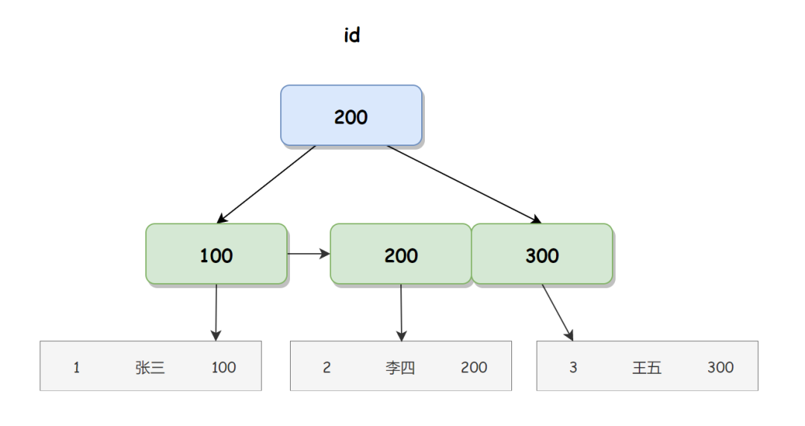
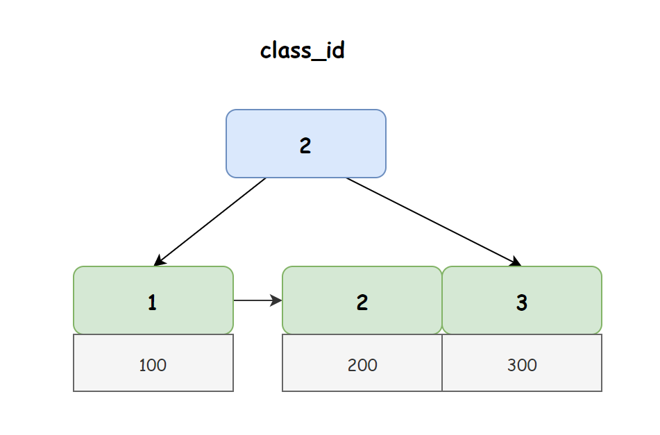

# CRM客户管理系统

## 1.解决bug商机管理-->公海池的线索捞取失败:提示剩余可以捞取线索-5条

原因:在TbClueServiceImpl的业务方法中使用**个人最大的线索持有量-目前的用户线索的持有量**得出剩余可以捞取线索-5条,这是有问题的,数据可能出现了问题,直接让其返回0而不是相减的值;

## 2.今日简报实现显示今日新增线索数量，商机数量，合同数量，成交的金额

新增线索数量这个的实现并不复杂,主要是理清表与表的关系,写SQL语句而已

首先明确几个条件-->该用户名下今天新增的线索数量-->该用户, 今天 ,线索的数量;

1.**确定一条线索的最终归属人是谁,因为线索可能有多个被分配的人**,那就要去找分配表,这里表里面既有商机也有线索信息,那指定type值为0先确定线索,再用latest=1确定最新的分配人;--->这样就完成了第一条

2.确认今天的日期,那这个日期的话是不能直接被比较的,因为我们数据库存储的时间是包含了时分秒的,所以我这里用SQL语句中的一个date_format的一个日期函数,让日期**只比较年月日,不会精确到时分秒**;---->这样就完成了第二条

3.线索的数量就要书写一个聚合函数来计算出这条线索的新增--->这样就完成了第三条;

## 3.今日待办数据统计接口

**这里的需求就是查询用户在选定范围内的待跟进线索,商机,和待分配线索和商机**

对于销售主管来说，主要的工作是分配线索和商机，对于销售人员来说主要是跟进线索和商机

销售主管:待分配线索和商机--->查询出存在于线索表或者商机表中,但不存在于分配表中的数据;

销售人员:待跟进线索和商机--->查询出该用户下分配表中状态值为待跟进的线索或者商机;

## 4.EasyExcel实现批量导入线索

先进行技术的调研:查看官网,查看官方文档;

明白了简单的使用方法:首先是需要导入EasyExcel的依赖,创建对应的实体类,创建监听类实现ReadListener接口并且需要在监听器内,invoke方法和doAfterAllAnalysed方法,其中invoke方法当EasyExcel解析了一条数据后就会执行, doAfterAllAnalysed方法，在所有数据都解析完成后会执行

## 5.Minio实现上传合同

跟EasyExcel的技术调研方法差不多,查看官方文档;

需要下载Minio的服务端,通过命令启动mino,访问的默认端口号为9000;

我们可以发现Minio是由同bucke组成的,相当于是文件夹,我们可以创建一个桶尝试用Minio的控制台上传一个文件,用Minio生成的分享连接就可以查看刚刚上传的文件了.但是存在一个问题上传的文件不能直接暴露出去,就是说不能使用直接访问路径的方法来查看文件,必须要通过这个分享的连接查看,需要操作控制台放开这个权限.


1.那我们如果要在java中操作Minio首先就是导入依赖;

2.定义一个上传类模仿官方文档的方法指定上传的路径,文件的名称由UUID类生成;

# 宜享家

## 1.Redis与mysql数据怎么保持一致性

如果是mysql的数据发生变更, redis需要重新导入数据,那么我们是严格 按照 **先删redis再查询mysql的一个原则**,但是这样的话极端情况下还是会出现问题,比如一个线程在删除时,又一个线程在查询,有可能极端情况下让Redis没有把旧数据删干净,下次访问的还是旧数据,这时候就加一个**延迟双删**就好了;

## 2.一次扫描多少?一共多少篇文章?

一次扫描检测所有状态为4|8(自动审核通过|人工审核通过)的房源(若是已经发布的状态为9),带上预留条件房源**提交时间早于当前时间的**;

```java
 //1.预留-->构建条件-->先设定时间
        WmNewsPageReqDto dto = new WmNewsPageReqDto();
        dto.setEndPubDate(new Date());
```

 初期的资讯都是网络爬虫爬的;


做这个导入的时候房源是easyexcel批量导入的,而审核通过的房源讯息同步时是使用xxl-job分批次分片同步讯息;


并发量我们是按着2千去测的,实际生产环境应该没有到达这个量, 用户的话在10万左右;


## 3.为什么这个时候找工作?

因为我之前的那个公司因为一个疫情的问题,就一直在线上办公的状态,基本每天也没有什么事情,而深圳离惠州也近,家里人都在惠州这边,想着也是时候找个近一点的地方办公会更好;

## 4.为什么MySQL在数据量达到千万级别使用索引变慢?以及索引树高度;


MySQL的B+树索引只有叶子节点存储真正的数据, 枝干节点只存key, 一般千万级别的数据量查询, B+树的高度一般在3-4层就足够了;

尽量减少索引中key值的占用空间---保持索引树高度在3-4层;


如果用id作为表的主键,id是否要自增?

要,因为页分裂;


1.一个表可以中多少个索引？
肯定不只有一个索引，可以根据用户需要来创建


2、如果一个表中3个索引，那么数据要存储几份？
注意，一个表儿无论有多少索引，数据只存储一份.


3、数据跟索引是否是放在一起的?

**是就是聚簇索引,不是就是非聚簇索引;**

就是innodb主键索引或者唯一健索引都属于聚簇索引，其他都属于非聚簇索引。myisam没有聚簇索引;

聚簇索引存放数据，非聚簇索引存放指针


聚簇索引 id 对应的 B+ 树, 如下图student所示：



在聚簇索引的叶子节点直接存储用户信息的内存地址，我们使用内存地址可以直接找到相应的行数据。

非聚簇索引在 InnoDB 引擎中，也叫二级索引， 如下图所示：



从上图我们可以看出，在非聚簇索引的叶子节点上存储的并不是真正的行数据，而是主键 ID，所以当我们使用非聚簇索引进行查询时，首先会得到一个主键 ID，然后再使用主键 ID 去聚簇索引上找到真正的行数据，我们把这个过程称之为回表查询。

**总结**

在 MySQL 的 InnoDB 引擎中，每个索引都会对应一颗 B+ 树，而聚簇索引和非聚簇索引最大的区别在于叶子节点存储的数据不同，聚簇索引叶子节点存储的是行数据，因此通过聚簇索引可以直接找到真正的行数据；而非聚簇索引叶子节点存储的是主键信息，所以使用非聚簇索引还需要回表查询，因此我们可以得出聚簇索引和非聚簇索引的区别主要有以下几个：

- 聚簇索引叶子节点存储的是行数据；而非聚簇索引叶子节点存储的是聚簇索引（通常是主键 ID）。

- 聚簇索引查询效率更高，而非聚簇索引需要进行回表查询，因此性能不如聚簇索引。

- 聚簇索引一般为主键索引，而主键一个表中只能有一个，因此聚簇索引一个表中也只能有一个，而非聚簇索引则没有数量上的限制。

	

注意：
1、InnoDB是通过B+Tree结构对主键创建索引，然后叶子节点中存储记录，如果没有主键，那么会选择唯一键，如果没有唯一键，那么会生成一个6字节的rowid来作为主键.

## 4.5回表,索引覆盖,最左匹配,索引下推

回表:

select from table where id =10;
select from table where name=zhangsan;
第一次查询name的b+树，根据name获到id,再根据id去id的B+树上找到行记录，这过程称之为回表, **效率不高,io次数会增多**;


索引覆盖:

select id,name from table where name=zhangsan;
再进行检索的时候，**直接根据name去name的B+树上获取到了id,name两个列值，此时不需要回表**;

 在实际开发中,可以考虑将不相关的列都设置为索引列;

比如:select id,name,age from table where name=zhangsan,可以虑将name,age作为联合索引(即将name,age变成了联合key,value为id);


最左匹配(是针对联合索引来说的):

最左优先，以最左边的为起点任何连续的索引都能匹配上。同时遇到范围查询(>、<、between、like)就会停止匹配。
例如：b = 2 如果建立(a,b)顺序的索引，是匹配不到(a,b)索引的；但是如果查询条件是a = 1 and b = 2或者a=1(又或者是b = 2 and b = 1)就可以，因为优化器会自动调整a,b的顺序。再比如a = 1 and b = 2 and c > 3 and d = 4 如果建立(a,b,c,d)顺序的索引，d是用不到索引的，因为c字段是一个范围查询，它之后的字段会停止匹配。

**select from table where name=?**
**select from table where name=?and age=?**
**select*from table where age=?and name=?有一个组件叫做优化器**
**select from table where age=?**


索引下推(不是重点):

select from table where name=?and age=?
在没有索引下推之前，先根据name去存储引擎中拉取符合结果的数据，返回到server层，在server层中对age的条件进行过滤有了索引下推之后，根据name,age两个条件直接从存储引擎中拉取结果，不需要再server层做条件过滤在**mysql5.7版本之后默认开启**;


如何进行索引优化:


## 5.消息丢失怎么解决

RabbitMQ:

消息还未发到交换机, 交换机还没有路由到队列;--->开启生产者确认机制, 生产者到交换机(ack或者nack), 交换机路由到队列(ACK以及路由失败的原因)

 

队列还没有发送给消费者; ---->开启消费者的一个确认机制,实现队列和消息的持久化.


还有就是在配置文件里配置失败重试机制;


 KafkaMQ: 

生产者: 消息批量发送, 生产者确认机制,1是消息到了leader,leader没有把消息同步给集群就返回成功发送;

 consumer:消息批量拉取,默认500,提交offset记录消费的位置,即使宕机了也可以保证从offset的地方进来.


但是有可能重复消费?解决:给数据加上唯一标识


通过消息回溯可以找到和定位任意的offset开始

## 6.怎么实现热点新闻，所有用户查看的文章都是固定的吗?

每天的凌晨4点钟左右定时任务去筛选日期前5天的房源资讯,按照比例进行资讯的分值计算,然后会将资讯的id存储到Zset中.


KafkaStream流式处理器对这些文章做一个聚合, 实时计算(就是对阅读,点赞,关注,收藏的一个加权计分,因为是实时的所以计分之后,我们是把这个分值*3存储到redis中的-->只存id)热点房源讯息将id存在Redis中,用户在首页刷新时推荐;

只存id不存内容: 因为占资源; 因为存内容里面是有这个点赞收藏数的,如果是修改过了,这个redis是没办法将其覆盖的;


不是

用户的行为信息是我们负责收集的,但目前没有针对每个用户推送不同热点文章的功能.

## 7.zset的结构有了解吗

String简单动态字符串  List双向链表+压缩列表

Set 哈希表+整数数组

Hash 哈希表+压缩列表

sorted set **压缩列表(本质就是个数组,只是加了列表长度,尾部偏移量,列表元素个数,列表结束标识)[便于快速查找首尾节点]**

**+跳表**


zset就是一个有序且是不重复上的数据结构

那什么时候会采用压缩列表呢？
有序集合保存的元素数量小于128个
有序集合保存的所有元素的长度小于64字节


## 8.freemarker(这是前端的玩意)

 即一种基于模板和要改变的数据， 并用来生成输出文本(HTML网页，电子邮件，配置文件，源代码等)的通用工具。 它不是面向最终用户的，而是一个Java类库，是一款程序员可以嵌入他们所开发产品的组件。


## 9.如果使用分布式锁，一个用户拿到锁没有释放，其它用户一直等待吗?

seata中默认是AT模式

在seata中配置超时处理,似乎是@GlobalTransactional;

# 立可得

## 1.用户认证模块